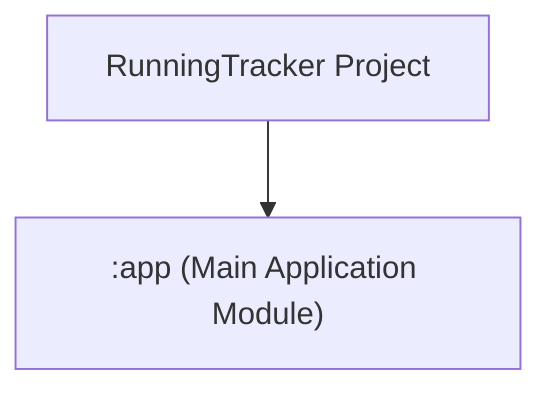
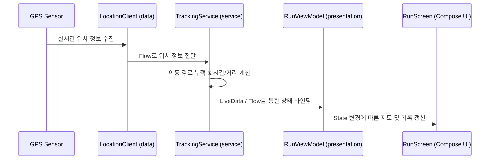
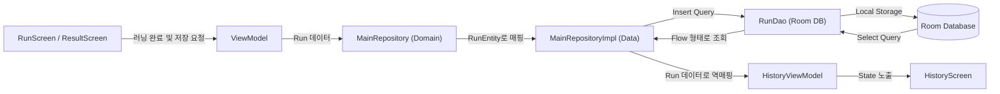

# RunningTracker

## 📱 프로젝트 소개
**RunningTracker**는 사용자의 러닝 활동을 실시간으로 추적하고 기록하는 안드로이드 애플리케이션입니다.
직관적인 UI와 정확한 위치 추적 기능을 통해 사용자에게 향상된 러닝 경험을 제공합니다.

## ✨ 주요 기능
- **실시간 위치 추적**: Google Maps API를 활용하여 러닝 경로를 실시간으로 지도에 표시합니다.
- **러닝 데이터 기록**: 이동 거리, 시간, 평균 속도, 소모 칼로리 등 핵심 운동 데이터를 실시간으로 계산하고 보여줍니다.
- **러닝 히스토리**: 완료된 러닝 기록을 Room Database에 로컬 저장하여 언제든지 과거 기록을 조회할 수 있습니다.
- **통계 및 분석**: 주간/월간 러닝 데이터를 그래프 형태로 시각화하여 사용자의 운동 성과를 분석해줍니다.
- **백그라운드 트래킹**: Foreground Service를 통해 앱이 백그라운드 상태일 때도 안정적으로 위치를 추적합니다.

## 🛠 기술 스택
- **Language**: Kotlin
- **Architecture**: MVVM, Clean Architecture
- **UI Framework**: Jetpack Compose (Material3)
- **Dependency Injection**: Hilt
- **Asynchronous Processing**: Coroutines, Flow
- **Local Database**: Room
- **Network & Location**: Google Maps SDK, Fused Location Provider Client
- **Ads**: Google AdMob

## 📂 모듈 및 디렉터리 구조

### 1. 모듈 구조 (Module Structure)
이 프로젝트는 현재 **단일 모듈(Single Module)** 아키텍처로 설계되어 있습니다.
- `:app`: 모든 비즈니스 로직, UI, 데이터 처리를 담당하는 메인 애플리케이션 모듈입니다.

---

### 2. 앱 패키지 구조 (App Package Structure)
앱은 Clean Architecture 구조에 따라 관심사별로 패키지가 분리되어 있습니다.

- **`core`**: 앱 전반에서 공통으로 사용되는 의존성 및 유틸리티
  - `di`: Hilt 관련 모듈들 (AppModule, DataSourceModule, LocationModule, ManagerModule, RepositoryModule, ServiceModule)
  - `util`: 날짜 변환 등 공통 유틸리티 클래스
- **`data`**: 로컬 데이터베이스 접근 및 위치 센서 연동 등 데이터 계층
  - `datasource`: 데이터 소스 인터페이스 및 구현체 (Room Local)
  - `local`: Room Database, DAO(RunDao), Entity(Run)
  - `location`: Fused Location Provider Client를 사용하는 실시간 위치 트래커 구현체
  - `mapper`: Data 모델과 Domain 모델 간의 변환기
  - `repository`: `domain` 계층의 Repository 인터페이스 구현체 (`MainRepositoryImpl`)
- **`domain`**: 프레임워크와 완전히 격리된 순수 Kotlin 비즈니스 로직 계층
  - `model`: 도메인 영역에서 정의하는 핵심 데이터 객체
  - `repository`: 데이터 레이어와 통신하기 위해 정의한 인터페이스 (`MainRepository`)
  - `location`: 위치 센서 추적을 위한 인터페이스 (`LocationClient`, `GpsStatusClient`)
- **`presentation`**: 사용자에게 화면을 띄워주고 입력을 처리하는 UI 계층 (MVVM + Jetpack Compose)
  - `home`, `run`, `result`, `history`: 화면 단위별 구현 (ViewModel, State, Screen)
  - `components`, `designsystem`: 공통 UI 테마 및 재사용 가능한 Compose 컴포넌트
  - `navigation`: Jetpack Navigation Compose 경로 정의
- **`service`**: 백그라운드 작업을 관리하는 서비스 계층
  - `TrackingService`: Foreground Service를 사용하여 앱이 꺼지거나 백그라운드에 있을 때도 GPS 위치를 안정적으로 추적합니다.

---

### 3. 데이터 흐름 (Data Flow)
MVI 및 MVVM 패턴에 부합하게 데이터가 예측 가능한 단방향/양방향 흐름으로 제어됩니다.

#### A. 실시간 위치 추적 데이터 흐름

#### B. 러닝 데이터 저장 및 이력 조회 흐름

---

### 4. DI 구조 (Dependency Injection Structure)
Hilt를 사용해 컴포넌트 간 결합도를 낮추고 의존성을 주입합니다.

* **`AppModule`**: `ApplicationContext` 기반의 `Room Database` 인스턴스, `RunDao`, `FusedLocationProviderClient`, 그리고 코루틴 제어를 위한 `ApplicationScope`를 제공합니다.
* **`DataSourceModule`**: 데이터 소스 구현체를 바인딩합니다.
* **`LocationModule`**: 빌드 Flavor(dev/prod)에 따라 `MockLocationClient`/`MockGpsStatusClient` 또는 실제 Fused Location 기반의 `DefaultLocationClient`/`DefaultGpsStatusClient`를 바인딩하여 유연하게 동작합니다.
* **`RepositoryModule`**: `MainRepositoryImpl`을 `MainRepository` 인터페이스에 바인딩합니다.
* **`ServiceModule`**: Foreground Service에서 알림을 띄우기 위한 `NotificationCompat.Builder`와 `PendingIntent` 등을 관리합니다.

## 📸 스크린샷

| 홈 | 운동 시작 | 종료 | 저장된 런닝 기록 |
|----|-----------|----------|------|
|  |  | |   |

## 다운로드

